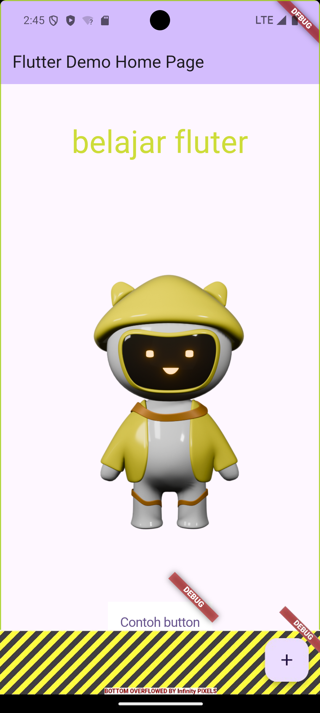

1.  Praktikum Membuat Project Flutter Baru
    

2.  praktikum Membuat Repository GitHub dan Laporan Praktikum
    

3.  praktikum Menerapkan Widget Dasar
    

    

4.  praktikum Menerapkan Widget Material Design dan iOS Cupertino
    

    

    

    

    

    

    

    
